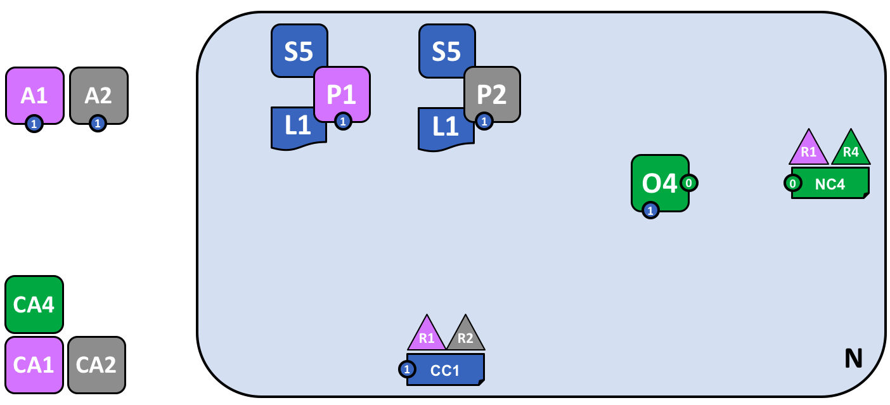
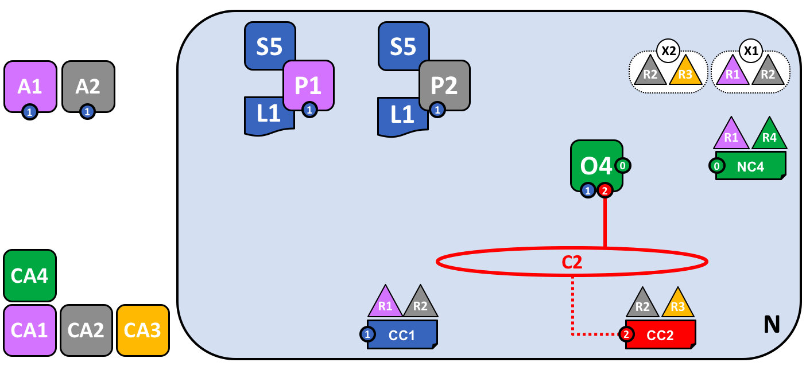

# 区块链网络

本主题将**在概念层次上**描述 Hyperledger Fabric 是如何允许组织间以区块链网络的形式进行合作的。如果您是架构师、管理员或开发人员，您可以使用这个主题来深入了解 Hyperledger Fabric 区块链网络中的主要结构和流程组件。本主题将使用一个可管理的工作示例介绍区块链网络中的所有主要组件。理解了这个示例之后，您可以在文档的其他地方阅读关于这些组件的更详细的信息，或者尝试[构建一个示例网络](../build_network.html)。

阅读本主题并理解策略的概念之后，你就能够很好的理解组织在控制一个部署好的 Hyperledger Fabric 网络时所需要建立的决策。您还将了解组织如何使用声明性策略（Hyperledger Fabric的一个关键特性）管理网络演化。简而言之，您将了解  Hyperledger Fabric 的主要技术组件以及组织需要对此做出的决策。

## 什么是区块链网络？

区块链网络是为应用程序提供账本和智能合约（链码）服务的技术基础设施。首先，智能合约用于生成交易，这些交易随后被分发到网络中的每个节点，并在每个节点的账本副本上记录下来并且是不可篡改的。这个应用程序的用户可能是使用客户端应用的最终用户，或者是一个区块链网络的管理员。

在大多数情况下，多个[组织](../glossary.html#organization)作为一个[联盟](../glossary.html#consortium)聚集在一起形成网络，它们的权限由一组[策略](../glossary.html#policy)决定，这些策略在最初配置网络时由联盟商定。此外，网络策略可以随着时间的推移而变化，这取决于联盟中的组织的协议，我们将在讨论*修改策略*的概念时发现这一点。

## 示例网络

在开始之前，让我们先展示一下我们最终要做的东西！这是一个表示示例网络**最终状态**的图表。

不要担心这个看起来很复杂！在学习本主题的过程中，我们将逐步构建网络，以便您了解 R1、R2、R3 和 R4 是如何为网络中提供基础设施并且从中获益。这个基础设施实现了区块链网络，并且它是按照网络中的组织都同意的规则来管理的——比如，谁可以添加新的组织。你会发现应用程序是如何使用账本以及区块链网络所提供的智能合约服务。

*R1、R2、R3 和 R4 这四个组织已经共同决定，并签署了一份协议，他们将建立和开发一个 Hyperledger Fabric 网络。 R4 被指定为网络初始者，它有权利来设置网络的初始版本，但 R4 不会在网络中去进行任何的业务交易。R1 和 R2 在整体网络中有进行私自的沟通的需求， R2 和 R3 也是。组织 R1 有一个客户端应用程序，可以在通道 C1 中执行业务交易。组织 R2 有一个客户端应用程序，它可以在通道 C1 和  C2 中执行相似的工作。组织 R3 有一个客户端应用程序可以在通道 C2 上实现这一点。节点 P1 维护与 C1 关联的账本 L1 的副本。节点 P2 维护与 C1 关联的账本 L1 和与 C2 关联的账本 L2 的副本。节点 P3 维护与 C2 关联的账本 L2 的副本。网络根据网络配置 NC4 中指定的策略规则进行治理，网络受组织 R1 和 R4 的控制。通道 C1 根据通道配置 CC1 中指定的策略规则进行管理；通道由组织 R1 和 R2 控 制。通道 C2 按照通道配置 CC2 中指定的策略规则进行管理；由组织 R2 和 R3 控制。有一个排序服务 O4 作为 N 的网络管理节点，并使用系统通道。排序服务还支持应用程序通道 C1  C2，来对交易进行排序、加入区块然后分发。这四个组织都有一个证书颁发机构。*

## 创建网络

让我们从创建网络的基础开始:

*当一个排序节点启动后网络就形成了。在我们的示例网络 N 中，包含单个节点 O4 的排序服务根据网络配置 NC4 进行配置，NC4 赋予组织 R4 管理权限。在网络层面，证书颁发机构 CA4 用于向组织 R4 的管理员和网络节点分配身份信息。*

我们可以看到，定义**网络 N** 的第一个东西是**排序服务 O4**。将排序服务看作是网络的初始管理点是很有用的。如前所述，O4 最初由组织 R4 中的管理员配置和启动，并托管在 R4 中。配置 NC4 包含描述网络初始管理功能集的策略。最初，在网络上只为 R4 授予这样的权限。我们稍后会看到这将会发生变化，但是现在 R4 是网络中唯一的成员。

### 证书认证机构

你还可以看到一个证书认证机构 CA4，它用于向管理员和网络节点颁发证书。CA4 在我们的网络中扮演着关键角色，因为它分发的 X.509 证书可用于标识属于组织 R4 的组件。CA 签发的证书也可以用于签署交易，以表明一个组织对交易结果部署，这是该笔交易可以被接受并记录到账本上的一个前提条件。让我们更详细地研究一下 CA 的这两个方面。

首先，区块链网络的不同组件使用证书相互标识自己来自特定组织。这就是为什么支持区块链网络的 CA 通常不止一个（不同的组织经常使用不同的 CA）。我们将在网络中使用四个 CA，每个组织一个。事实上，CA是非常重要的，所以 Hyperledger Fabric 提供给你一个内置的 CA （称为 Fabric-CA）来帮助您开始工作，尽管在实践中，组织会选择使用它们自己的 CA。

将证书同成员组织进行匹配是同时一个称为[成员服务提供者](../glossary.html#membership-services)（Membership Service Provider， MSP）的结构来实现的。网络配置 NC4 使用一个命名的 MSP 来标识 CA4 分发的证书的属性，CA4 将证书持有者与组织 R4 关联起来。NC4 接下来会使用这个在规则中的 MSP 名字来分配在网络资源上的特殊权利。这种策略的一个例子是识别 R4 中的管理员，管理员可以向网络添加新的成员组织。我们没有在这些图上显示 MSP，因为他们会很杂乱，但是它们非常重要。

其次，我们将在稍后看到 CA 颁发的证书如何成为[交易](../glossary.html#transaction)生成和验证过程的核心的。具体来说，X.509 证书用于客户端应用程序[交易提案](../glossary.html#proposal)和智能合约[交易响应](../glossary.html#response)中，以便对[交易](../glossary.html#transaction)进行数字签名。随后，持有账本副本的网络节点在接受账本上的交易之前验证交易签名是否有效。

让我们回顾一下示例区块链网络的基本结构。有一个由证书颁发机构 CA4 定义的一组用户可访问的资源——网络 N，这些用户对网络 N 中的资源拥有一组权限，这些权限由网络配置 NC4 中包含的策略描述。当我们配置并启动排序服务节点 O4 时，所有这些都变为现实。

## 添加网络管理员

NC4 最初配置为只允许 R4 用户在网络上拥有管理权限。在下一阶段，我们将允许组织 R1 用户管理网络。让我们看看网络是如何演变的：

*组织 R4 更新网络配置，使组织 R1 也成为管理员。在这一点之后，R1 和 R4 对网络配置具有同等的权限。*

我们看到添加了一个新的组织 R1 作为管理员，R1 和 R4 现在在网络上拥有相同的权限。我们还可以看到已经添加了证书颁发机构 CA1，它可以用来标识来自 R1 组织的用户。在此之后，R1 和 R4 的用户都可以管理网络。

虽然排序节点 O4 运行在 R4 的基础设施上，但是 R1 拥有同样的管理权限。这意味着 R1 或 R4 可以更新网络配置 NC4，使 R2 组织也可以操作网络。通过这种方式，尽管 R4 运行着排序服务，但是 R1 在其中也具有着全部的管理员权限，R2 具有着有限的创建新的联盟的权限。

在这个最简单的模式中，排序服务在网络中是一个独立的节点，就像你在例子中看到的。排序服务通常是多节点的，并且可以配置为在不同的组织中拥有不同的节点。例如，我们可以在 R4 中运行 O4 并将其连接到 O2，这是组织 R1 中的一个单独的排序节点。这样，我们就有了一个多站点、多组织的管理结构。

我们将在本主题的[稍后部分](#the-ordering-service)进一步讨论排序服务，但是现在只将排序服务看作一个管理节点，它给不同的组织提供了对于网络的管理的权限。

## 定义联盟

虽然现在网络可以由 R1 和 R4 管理，但是这样还是不够的。我们需要做的第一件事是定义一个联盟。这个词表示“具有着共同命运的一个群组”，所以这个是在一个区块链网络中合理地选择出来的一些组织。

让我们来看看联盟是如何定义的：

*一个网络管理员定义了一个包含两个成员的联盟 X1，包含组织 R1 和 R2。这个联盟定义存储在网络配置 NC4 中，将在网络开发的下一阶段使用。CA1 和 CA2 分别是这些组织的证书认证机构。*

由于 NC4 的配置方式，只有 R1 或 R4 可以创建新的联盟。这个图显示了一个新的联盟 X1 的添加，它将 R1 和 R2 定义为组成它的组织。我们也看到了 CA2 也被添加进来来标识来自于 R2 的用户。请注意，一个联盟可以有任意数量的组织成员，我们仅仅包含了两个组织作为一个最简单的配置。

为什么联盟很重要？我们可以看到，一个联盟定义了网络中的一部分组织，它们都需要彼此进行**交易**——在本例中是 R1 和 R2。如果组织有一个共同的目标，那么将它们组织在一起是很有意义的，而这正是正在发生的事情。

这个网络虽然最初仅包含一个组织，但现在由一组更大的组织控制。我们可以这样开始，R1、R2 和 R4 共享控制权，但是这种构建使它更容易理解。

现在，我们将使用联盟 X1 创建一个非常重要的 Hyperledger Fabric 区块链的部分——**通道**。

## 为联盟创建一个通道

让我们创建 Fabric 区块链网络的这个关键部分——**通道**。通道是一个主要的通信机制，通过它联盟的成员可以彼此通信。网络中可以有多个通道，但是现在，我们先从一个开始。

让我们看看第一个通道是如何添加到网络的：

*使用联盟定义 X1 为 R1 和 R2 创建了通道 C1。通道由通道配置 CC1 控制，完全独立于网络配置。CC1 由 R1 和 R2 管理，它们对 C1 拥有相同的权限。R4 在 CC1 中没有任何权限。*

通道 C1 为联盟 X1 提供了一个私有通信机制。我们可以看到通道 C1 已经连接到排序服务 O4，但是没有附加任何其他内容。在网络开发的下一个阶段，我们将连接组件，比如客户端应用程序和 Peer 节点。但在这一点上，通道代表了未来连接的**潜力**。

尽管通道 C1 是网络 N 的一部分，但它与网络 N 是有很大区别的。还要注意，组织 R3 和 R4 不在这个通道中——它用于 R1 和 R2 之间的交易处理。在前面的步骤中，我们了解了 R4 如何授予 R1 创建新联盟的权限。值得一提的是，R4 **也**允许 R1 创建通道！在这个图中，创建通道 C1 的可能是组织 R1 或 R4。同样，请注意，通道可以有任意数量的组织连接到它——我们目前只包含了两个组织，因为它是最简单的配置。

同样，请注意通道 C1 如何具有与网络配置 NC4 完全独立的配置 CC1。CC1 包含控制 R1 和 R2 对通道 C1 拥有的权限的策略，正如我们已经看到的，R3 和 R4 在这个通道中没有权限。R3 和 R4 只有在由 R1 或 R2 添加到通道配置 CC1 中的适当策略时才能与 C1 交互。一个例子是定义谁可以向通道添加新组织。特别需要注意的是， R4 不能将自己添加到通道 C1 中——它只能由 R1 或 R2 授权。

为什么通道如此重要？通道非常有用，因为它提供了一个联盟成员之间进行私有沟通和私有数据的机制。通道提供区别于其他通道和网络的隐私。在这方面，Hyperledger Fabric 非常强大，因为它允许组织共享基础设施，同时又保持私有。这里没有矛盾——网络中的不同联盟需要适当共享不同的信息和流程，而通道提供了一种有效的机制。通道提供高效的基础设施共享，同时维护数据和通信隐私。

我们还可以看到，一旦创建了通道，它会真正地代表了“自由于网络”。从现在开始 和未来，只有在通道配置中显式指定的组织才能控制它。同样，此后对网络配置 NC4 的任何更新都不会对通道配置 CC1 产生直接影响；例如，如果更改了联盟定义 X1，则不会影响通道 C1 的成员。因此，通道是有用的，因为它们允许组成通道的组织之间进行私人通信。此外，通道中的数据与网络的其他部分完全隔离，包括其他通道。

另外，还定义了一个特殊的**系统通道**供排序服务使用。它的运行方式与常规通道完全相同，因此常规通道有时称为**应用程序通道**。我们通常不需要担心这个通道，但是我们将在本主题的[后面](#the-ordering-service)对此进行更多的讨论。

## 节点和账本

现在让我们开始使用通道将区块链网络和组织组件连接在一起。在网络开发的下一个阶段，我们能够看到我们的网络 N 又新增了两个组件，即节点 P1 和账本实例 L1。

*节点 P1 已加入通道 C1。P1 物理上保存着账本 L1 的副本。P1 和 O4 可以使用通道 C1 进行通信。*

节点是保存区块链账本副本的网络组件！现在，我们已经开始看到了一些区块链标志性的组件了！P1 在网络中的目的单纯地是存放 L1 账本的一个副本供其他人访问。我们可以将 L1 看作物理上托管在 P1 上，但是逻辑上托管在通道 C1 上。当我们向通道添加更多的节点时，我们会更清楚地看到这个想法。

P1 配置的一个关键部分是由 CA1 发布的 X.509 身份信息，它将 P1 与组织 R1 关联起来。一旦 P1 启动，它就可以使用排序节点 O4 连接通道 C1。当 O4 接收到这个连接请求时，它使用通道配置 CC1 来确定 P1 在这个通道上的权限。例如，CC1 确定 P1 是否可以读写账本 L1 的信息。

注意节点是如何由拥有它们的组织连接到通道的，尽管我们只添加了一个 Peer 节点，但是我们将会看到网络中的多个通道上如何具有多个 Peer 节点的。稍后我们将看到 Peer 节点可以扮演的不同角色。

## 应用程序和智能合约

现在通道 C1 拥有了一个账本，我们可以连接客户端应用来使用由 Peer 节点提供的服务了。

注意网络是如何变化的：

*一个智能合约 S5 已经安装到 P1 上。组织 R1 中的客户端应用程序 A1 可以使用 S5 通过 peer 节点 P1 访问账本。A1、P1 和 O4 都加入了通道 C1，即它们都可以使用该通道提供的通信设施。*

在网络开发的下一个阶段，我们可以看到客户端应用程序 A1 可以使用通道 C1 连接到特定的网络资源——在这种情况下，A1 可以连接到 Peer 节点 P1 和排序节点 O4。同样，看一下通道对于网络和组织组件之间的通信是如何起中心作用的。就像 Peer 节点和排序节点一样，一个客户端应用也会有一个使它和一个组织相关联的身份信息。在我们的示例中，客户端应用程序 A1 与组织 R1 相关联；虽然它在 Fabric 区块链网络之外，但是它通过通道 C1 与之连接。

现在我们能够清楚地看到 A1 能够通过 P1 直接访问账本 L1，但是事实上，所有的访问都是通过一个名为智能合约链码的特殊程序 S5 来管理的。可以认为 S5 定义了对账本的所有通用访问模式；S5 定义了一组方法，通过这些方法可以查询或更新账本 L1。简而言之，客户端应用程序 A1 必须通过智能合约 S5 才能访问账本L1！

每个组织中的应用程序开发人员都可以创建智能合约链码，以实现联盟成员共享的业务流程。智能合约用于帮助生成交易，这些交易随后可以分发到网络中的每个节点。我们稍后会讨论这个想法；当网络更大时，就更容易理解了。现在，需要理解的重要事情是，要达到这一点，必须对智能合约执行两个操作；它必须先**安装**，然后**实例化**。

### 安装一个智能合约

在一个智能合约 S5 被开发完之后，组织 R1 中的管理员必须将其[安装](../glossary.html#install)到 Peer 节点 P1 上。这是一个简单的操作。安装完成后，P1 对 S5 有了充分的了解。具体来说， P1 可以**看到** S5 的实现逻辑，S5 是用来访问账本 L1 的程序代码。我们将此与 S5 接口进行对比， S5 **接口**只描述 S5 的输入和输出，而不考虑它的实现。

当一个组织在一个通道中有多个 Peer 节点时，它可以选择哪个节点可以安装智能合约；它不需要在每个节点上都安装智能合约。

### 实例化一个智能合约

但是，仅仅为 P1 安装了 S5，其他连接到通道 C1 的组件并不知道它；它必须首先在通道 C1 上[实例化](../glossary.html#instantiate)。在我们的示例中，只有一个 Peer 节点 P1，组织 R1 中的管理员必须使用 P1 在通道 C1 上实例化 S5。实例化后，通道 C1 上的每个组件都知道存在 S5；在我们的示例中，这意味着 S5 现在可以由客户端应用程序 A1 [调用](../glossary.html#invoke)了！

注意，尽管通道上的每个组件现在都可以访问 S5，但是它们不能看到它的程序逻辑。这对安装了它的节点仍然是私有的，在我们的例子中，这意味着 P1。从概念上讲，这意味着实例化的是智能合约**接口**，而不是安装的智能合约实现。为了强调这一观念，安装智能合约**显示**了我们如何认为它是**物理上**托管在 Peer 节点上的，而实例化智能合约则显示了我们如何从**逻辑上**考虑它是由通道托管的。

### 背书策略

实例化时提供的最重要的附加信息是[背书策略](../glossary.html#endorsement-policy)。它描述了哪些组织必须批准交易，然后才会被其他组织接受到他们的账本上。在我们的示例网络中，只有在 R1 或 R2 背书的情况下，交易才能被接受并存储到账本 L1 上。

实例化行为将背书策略放置在通道配置 CC1 中；它使通道的任何成员都可以访问它。您可以在[交易流程主题](../txflow.html)中阅读更多关于背书策略的信息。

### 调用一个智能合约

一旦在 Peer 节点上安装了智能合约并在通道上实例化了它，客户端应用程序就可以调用它了。客户端应用程序通过向智能合约背书策略指定的组织所属的节点发送交易提案来实现这一点。交易提议作为智能合约的输入，智能合约使用它生成一个经过背书的交易响应，该响应由 Peer 节点返回给客户端应用程序。

这些交易响应与交易提案打包在一起，形成一个完整背书的交易，他们会被分发到整个网络。稍后我们将更详细地讨论这个问题，现在了解应用程序如何调用智能合约来生成经过背书的交易就足够了。

在网络开发的这个阶段，我们可以看到组织 R1 完全参与了网络。它的应用程序从 A1 开始，通过智能合约 S5 访问账本 L1，生成将由 R1 背书的交易，最后会被接受并添加到账本中，因为这满足了背书策略。

## 网络设置完成

回想一下，我们的目标是为联盟 X1（由组织 R1 和 R2构成）创建一个通道。网络开发的下一阶段将看到组织 R2 将它的基础设施添加到网络中。

让我们看看网络是如何演化的：

*网络是通过增加 R2 组织的基础设施而发展起来的。具体地说， R2 添加了 Peer 节点 P2，它会存有账本 L1 的一个副本和链码 S5。P2 也加入了通道 C1，应用程序 A2 也是如此。A2 和 P2 是使用 CA2 的证书识别的。所有这些意味着应用程序 A1 和 A2 都可以使用 Peer 节点 P1 或 P2 在 C1 上调用 S5。*

我们可以看到组织 R2 在通道 C1 上添加了一个 peer 节点 P2。P2 还包含账本 L1 和智能合约 S5 的副本。我们可以看到 R2 还添加了客户端应用程序 A2，它可以通过通道 C1 连接到网络。为了实现这一点，R2 组织中的管理员创建了 peer 节点 P2 并将其连接到通道 C1，与 R1 中的管理员的方法相同。

我们创建了我们的第一个可运行的网络！在网络开发的这个阶段，我们有一个通道，组织 R1 和 R2 可以在这个通道中彼此交易。具体来说，这意味着应用程序 A1 和 A2 可以使用通道 C1 上的智能合约 S5 和账本 L1 生成交易。

### 生成并接受交易

相比较于经常会存有账本副本的 Peer 节点，我们能够看到两种类型的 Peer 节点，一类是存储智能合约而另一类则不存。在我们的网络中，每个 Peer 节点都会存储智能合约的副本，但是在更大的网络中，将有更多的 Peer 节点不存储智能合约的副本。Peer 节点运行安装在它上边的智能合约，但是它可以通过连接到通道来了解智能合约的接口。

您不应该认为没有安装智能合约的 Peer 节点在某种程度上是较差的。更重要的是，拥有智能合约的 Peer 节点具有一种特殊的能力——帮助**生成**交易。注意，所有 Peer 节点都可以在其账本 L1 副本上**验证**并随后**接受**或**拒绝**交易。然而，只有安装了智能合约的 Peer 节点才能参与交易**背书**过程，而交易背书是生成有效交易的核心。

在这里，我们不需要担心交易生成、分发和接受的具体细节——只要了解我们有一个区块链网络，其中的组织 R1 和 R2能够共享由账本记录的交易信息和流程就够了。我们将在其他章节中中学习更多关于交易、账本、智能合约的知识。

### 节点类型

在 Hyperledger Fabric 中，虽然所有 Peer 节点都是相同的，但它们可以根据网络的配置方式承担多个角色。现在，我们对典型的网络拓扑结构有了足够的了解，可以描述这些角色了。

  *[*记账节点*](../glossary.html#commitment)。在一个通道中的每个 Peer 节点都是一个记账节点。他们会接收生成的交易的区块，在这些区块被 Peer 节点验证之后会提交到它维护的账本副本中。

  *[*背书节点*](../glossary.html#endorsement)。每一个带有一个智能合约的 peer 节点都可以作为一个背书节点。然而，想要成为一个真正的背书节点，在 Peer 节点上的智能合约必须要被一个客户端应用使用，来生成包含数字签名的响应。背书节点这个术语就是对这个事实的真实参考。

  对于一个智能合约的一个背书策略明确了在交易能够被接受并且记录到记账节点的账本副本之前，哪些组织的  节点需要为交易提供数字签名。

这是 Peer 节点的两种主要类型，Peer 节点还可以扮演另外两个角色：

  *[*领导节点*](../glossary.html#leading-peer)。当一个组织在一个通道中具有多个节点的时候，会有一个领导节点，它是一个负责将交易从排序节点分发到该组织中其他记账节点的节点。一个节点可以选择参与静态的或者动态的领导节点的选择。

  这个是很有用的，从管理者的角度来考虑的话会有两套节点：一套是具有静态主导节点选择的，另一套是带有动态的领导节点选择的。对于静态的，0个或者多个节点可以被配置为领导节点。对于动态的，一个节点会被选举成为领导节点。另外，在动态选择领导节点的过程中，如果一个领导节点出错了，那么剩下的节点将会重新选举一个领导节点。

  这意味着一个组织的节点可以有一个或者多个领导节点连接到排序服务。这个对于一个处理大量的交易的大型网络有助于提升弹性以及可扩展性。

  *[*锚节点*](../glossary.html#anchor-peer)。如果一个节点需要同另外一个组织的一个节点进行通信的话，那么它可以使用对方组织的通道配置中定义的**锚节点**。一个组织可以拥有0个或者多个锚节点，并且一个锚节点能够帮助很多不同的跨组织间的通信场景。

需要注意的是，节点可以同时是提交节点、背书节点、领导节点和锚节点！只有锚节点是可选的，但总是会有一个领导节点、至少一个背书节点和至少一个提交节点。

### 安装但没有实例化

与组织 R1 类似，组织 R2 必须将智能合约 S5 安装到其节点 P2 上。这很明显——如果应用程序 A1 或 A2 希望在节点 P2 上使用 S5 来生成交易，那么它必须先存在；安装是实现此目的的机制。此时，节点 P2 拥有智能合约和账本的物理副本；与 P1 一样，它可以在账本 L1 的副本上生成和接受交易。

然而，与组织 R1 相反，组织 R2 不需要在通道 C1 上实例化智能合约 S5。这是因为组织 R1 已经在通道上实例化了 S5。实例化只需要发生一次；随后加入通道的任何节点都知道通道可以使用智能合约 S5。这一事实反映了账本 L1 和智能合约确实以物理方式存在于节点上，并以逻辑方式存在于通道上；R2 只是向网络添加了 L1 和 S5 的另一个物理实例。

在我们的网络中，我们可以看到通道 C1 连接两个客户端应用程序、两个 Peer 节点和一个排序服务。由于只有一个通道，所以这些组件只与一个**逻辑**账本交互。节点 P1 和 P2 具有与账本 L1 相同的副本。智能合约 S5 的副本通常使用相同的编程语言以相同的方式实现，但如果没有，它们必须在语义上等价。

我们可以看到，谨慎地向网络添加节点可以帮助支持增加的吞吐量、稳定性和弹性。例如，网络中更多的节点将允许更多的应用程序连接到它；组织中的多个节点将在计划内或计划外停机的情况下提供额外的弹性。

这一切都意味着，可以配置支持各种操作目标的复杂拓扑——网络的大小没有理论上的限制。此外，单个组织中的节点高效地发现和彼此通信的技术机制——[gossip 协议](../gossip.html#gossip-protocol)——将容纳大量节点，以支持此类拓扑。

谨慎地使用网络和通道策略，甚至可以对大型网络进行良好的治理。组织可以自由地向网络添加节点，只要它们符合网络商定的策略。网络及通道的策略在对于描绘一个去中心化网络中的自主和受管控之间创建了平衡。

## 简化视觉词汇表

现在我们要简化表示示例区块链网络的可视化词汇表。随着网络规模的增长，最初用来帮助我们理解通道的线路将变得很麻烦。想象一下，如果我们添加另一个节点或客户端应用程序或另一个通道，我们的图表将会多么复杂？

这就是我们马上要做的，在我们做之前，让我们先简化一下视觉词汇表。下面是我们目前开发的网络的一个简化表示：

*图中显示了网络 N 中与通道 C1 相关的事实如下：客户端应用程序 A1 和 A2 可以使用通道 C1 与节点 P1 和 P2 通信，以及排序节点 O4。节点 P1 和 P2 可以使用通道 C1 的通信服务。排序服务 O4 可以使用通道 C1 的通信服务。通道配置 CC1 适用于通道 C1。*

注意，通过用连接点替换通道线，简化了网络图，连接点显示为包含通道号的蓝色圆圈。没有任何信息丢失。这种表示更具有可伸缩性，因为它消除了交叉行。这使我们能够更清晰地表示更大的网络。通过关注组件和通道之间的连接点，而不是通道本身，我们实现了这种简化。

## 添加另外一个联盟定义

在网络开发的下一阶段，我们将介绍组织 R3。我们要给组织 R2 和 R3 一个单独的应用通道让它们可以互相进行交易。这个应用程序通道将完全独立于前面定义的通道，因此 R2 和 R3 交易可以对它们保持私有。

让我们回到网络层，为 R2 和 R3 定义一个新的联盟 X2：

*来自组织 R1 或 R4 的网络管理员添加了一个新的联盟定义 X2，其中包括组织 R2 和 R3。这将用于为 X2 定义一个新通道。*

注意，网络现在定义了两个联盟：X1 表示组织 R1 和 R2， X2 表示组织 R2 和 R3。引入联盟 X2 是为了能够为 R2 和 R3 创建一个新的通道。

新通道只能由网络配置策略 NC4 中指定的具有适当权限的组织创建，即 R1 或 R4。这是一个策略的例子，它将能够在网络级别管理资源的组织与能够在通道级别管理资源的组织分开。看到这些策略的作用，有助于我们理解为什么 Hyperleder Fabric 具有复杂的**分层**策略结构。

实际上，联盟定义 X2 被添加到网络配置 NC4 中。我们将在文档的其他部分讨论此操作的确切机制。

## 添加一个新通道

现在让我们使用这个新的联盟定义 X2 来创建一个新的通道 C2。为了帮助你加深对更简单的通道符号的理解，我们使用了两种视觉样式——通道 C1 用蓝色的圆形端点表示，而通道 C2 用红色连接线表示：

*使用联盟定义 X2 为 R2 和 R3 创建了一个新的通道 C2。通道有一个通道配置 CC2，完全独立于网络配置 NC4 和通道配置 CC1。通道 C2 由 R2 和 R3 管理，R2 和 R3 对 CC2 中的策略定义的 C2 拥有相同的权限。R1 和 R4 在 CC2 中没有定义任何权限。*

通道 C2 为联盟 X2 提供了一种私有通信机制。同样，请注意组织如何在一个联盟中联合起来就形成了什么形式的通道。通道配置 CC2 现在包含了管理通道资源的策略，通道 C2 的管理权被分配给组织 R2 和 R3。它完全由 R2 和 R3 管理； R1 和 R4 在 C2 通道没有权力。例如，通道配置 CC2 可以被更新，以添加支持网络增长的组织，但这只能由 R2 或 R3 完成。

要注意的是通道配置 CC1 和 CC2 是如何彼此完全分离的，以及如何完全独立于网络配置 NC4。我们再次看到了Hyperledger  Fabric 网络的去中心化本质，一旦创建了通道 C2，它就由组织 R2 和 R3 独立于其他网络元素进行管理。通道策略始终保持彼此独立，并且只能由授权在通道中这样做的组织更改。

随着网络和通道的发展，网络和通道的配置也将发生变化。有一个能够以可控的形式实现这些的流程——引入能够获得对于这些配置的改动的配置交易。每个配置更改都会生成一个新的配置区块交易，在本主题的[后面](#the-ordering-serivce)，我们将看到如何验证和接受这些区块来更新网络和通道配置。

### 网络和通道配置

在我们的示例网络中，我们看到了网络和通道配置的重要性。这些配置非常重要，因为它们封装了网络成员同意的**策略**，这些策略为控制对网络资源的访问提供了一个共享的参考。网络和通道配置还包含关于网络和通道组成的**事实**，例如联盟及其组织的名称。

例如，当使用排序服务节点 O4 首次形成网络时，其行为由网络配置 NC4 控制。NC4 的初始配置只包含允许组织 R4 管理网络资源的策略。NC4 随后被更新，以允许 R1 管理网络资源。一旦进行了此更改，连接到 O4 的任何组织 R1 或 R4 的管理员都将拥有网络管理权限，因为这是网络配置 NC4 中的策略所允许的。在内部，排序服务中的每个节点记录网络配置中的每个通道，以便在网络级别创建每个通道的记录。

这意味着，尽管排序服务节点 O4 是创建联盟 X1 和 X2 以及通道 C1 和 C2 的参与者，但是网络的**智慧**包含在 O4 遵守的网络配置 NC4 中。只要 O4 表现得像一个好的参与者，并且在处理网络资源时正确地实现 NC4 中定义的策略，我们的网络就会像所有组织已经同意的那样运行。在许多方面， NC4 可以被认为比 O4 更重要，因为它最终控制网络访问。

与节点同样的概念也可以应用到通道配置。在我们的网络中， P1 和 P2 也是很好的参与者。当节点 P1 和 P2 与客户端应用程序 A1 或 A2 交互时，它们各自使用通道配置 CC1 中定义的策略来控制对通道 C1 资源的访问。

例如，如果 A1 想访问节点 P1 或 P2 上的智能合约链码 S5，每个节点使用其 CC1 的副本来确定 A1 可以执行的操作。例如， A1 可以根据 CC1 中定义的策略从账本 L1 中读取或写入数据。稍后我们将看到通道及其通道配置 CC2 中的角色的相同模式。同样，我们可以看到，虽然节点和应用程序是网络中的关键参与者，但是它们在通道中的行为更多地是由通道配置策略决定的，而不是其他因素。

最后，了解网络和通道配置是如何在物理上实现的是很有帮助的。我们可以看到网络和通道的配置在逻辑上是单一的——网络有一个，每个通道也有一个。这是很重要的，访问网络或通道的每个组件，对授予不同组织的权限必须共享理解。

即使存在逻辑上的单一配置，但它实际上被构成网络或通道的每个节点复制并保持一致。例如，在我们的网络节点 P1 和 P2 都有通道配置 CC1 的副本，当网络完全完成时，节点 P2 和 P3 都有通道配置 CC2 的副本。类似地，排序服务节点 O4 具有网络配置的副本，但是在[多节点配置](#the-ordering-service)中，每个排序服务节点都有自己的网络配置副本。

网络和通道配置在使用相同区块链技术上都保持一致，无论用于用户交易，还是用于**配置**交易。要更改网络或通道配置，管理员必须提交一个配置交易来更改网络或通道配置。它必须由在适当策略中标识为负责配置更改的组织签署。这个策略称为  *mod_policy**，我们[稍后](#changing-policy)将讨论它。

事实上，排序服务节点操作一个小型区块链，通过我们前面提到的**系统通道**连接。使用系统通道排序服务节点分发网络配置交易。这些交易用于在每个排序服务节点上协同维护网络配置的一致副本。以类似的方式，**应用程序通道**中的 Peer 节点可以分发通道配置交易。同样，这些交易用于在每个 Peer 节点上维护通道配置的一致副本。

物理上分布而逻辑上单一，这种对象之间的平衡是 Hyperledger Fabric 中的一种常见模式。例如，像网络配置这种对象，它逻辑上是单一的，但最终会在一组排序服务节点之间进行物理复制。我们还可以在通道配置、账本和某种程度上的智能合约中看到它，这些合约安装在多个位置，但是它们的接口逻辑上存在于通道级别。您可以在 Hyperledger Fabric 中多次看到这种模式，它使 Hyperledger Fabric 能够同时去中心化和可管理。

## 添加另一个节点

既然组织 R3 能够完全参与通道 C2，让我们将其基础设施组件添加到通道中。我们不是一次只做一个组件，而是同时添加一个节点、它的本地账本副本、一个智能合约和一个客户端应用程序！

让我们看看添加了组织 R3 组件的网络：

*图中显示了网络 N 中通道 C1 和 C2 的相关事实如下：客户端应用程序 A1 和 A2 可以使用通道 C1 与节点 P1 和 P2 通信，使用排序服务 O4；客户端应用程序 A3 可以使用通道 C2 与节点 P3 通信，并使用排序服务 O4。排序服务 O4 可以使用通道 C1 和 C2 的通信服务。通道配置 CC1 适用于通道 C1， CC2 适用于通道 C2。*

首先，请注意，由于节点 P3 连接到通道 C2，它与使用通道 C1 的节点具有**不同**的账本 L2。账本 L2 的有效范围是通道 C2。账本 L1 是完全独立的；它的作用域是通道 C1。这是有意义的——通道 C2 的目的是在联盟 X2 的成员之间提供私有通信，而账本 L2 是他们交易的私有存储。

类似地，安装在节点 P3 上并在通道 C2 上实例化的智能合约 S6用于提供对账本 L2 的受控访问。应用程序 A3 现在可以使用通道 C2 调用智能合约 S6 提供的服务，来生成可以被网络中的每个账本 L2 副本接受的交易。

此时，我们有一个单独的网络，其中定义了两个完全独立的通道。这些通道为组织之间的交易提供了独立管理的设施。这就是工作中的去中心化；我们在控制和自主之间取得了平衡。这是通过应用于由不同组织控制和影响的通道的策略来实现的。

## 把一个节点添加到多个通道中

在网络开发的最后阶段，让我们将重点放在组织 R2 上。我们可以利用 R2 是联盟 X1 和 X2 的成员这一事实，将其加入多个通道：

*图中显示了网络 N 中通道 C1 和通道 C2 的相关事实如下：客户端应用程序 A1 可以使用通道 C1 与节点 P1 和 P2通信，还有排序服务O4；客户端应用程序 A2 可以使用通道 C1 与节点 P1 和 P2 通信，通道 C2 与节点 P2 和 P3 通信，以及排序服务 O4；客户端应用程序 A3 可以使用通道 C2 与节点 P3 和 P2 通信，并使用排序服务O4。排序服务 O4 可以使用通道 C1 和 C2 的通信服务。通道配置 CC1 适用于通道 C1, CC2 适用于通道 C2。*

我们可以看到 R2 是网络中的一个特殊组织，因为它是两个应用程序通道中唯一的成员组织！它可以在通道 C1 上与组织 R1 进行交易，同时也可以在不同的通道 C2 上与组织 R3 进行交易。

请注意节点 P2 如何为通道 C1 安装了智能合约 S5，为通道 C2 安装了智能合约 S6。节点 P2 同时是两个通道的成员，通过不同的智能合约为不同的账本服务。

这是一个非常强大的概念——通道既提供了组织分离的机制，也提供了组织间协作的机制。一直以来，这个基础设施都是由一组独立的组织提供并在它们之间共享的。

同样重要的是，节点 P2 的行为控制非常不同，这取决于它交易所在的通道。具体来说，通道配置 CC1 中包含的策略规定了 P2 在通道 C1 中进行交易时可用的操作，而通道配置 CC2 中的策略控制了 P2 在通道 C2 中的行为。

这是我们所希望的—— R2 和 R1 同意通道 C1 的规则，而 R2 和 R3 同意通道 C2 的规则。这些规则是在各自的通道策略中适用——它们可以而且必须被通道中的每个组件使用，以强制执行正确的行为。

类似地，我们可以看到客户端应用程序 A2 现在能够在通道 C1 和 C2 上进行交易。同样，它也会按照在相关的通道配置中的策略来进行管理。另外，请注意客户端应用程序 A2 和节点 P2 使用的是混合的可视化词汇表——包括行和连接。可以看到它们是等价的；它们是视觉上的同义词。

### 排序服务

<<<<<<< HEAD
细心的读者可能会注意到，排序服务节点似乎是一个集中的组件；它最初用于创建网络，并连接到网络中的每个通道。尽管我们将 R1 和 R4 添加到控制排序节点的网络配置策略 NC4 中，该节点仍然运行在 R4 的基础设施上。在一个去中心化的世界里，这看起来是错误的！
=======
注意到对于 channel C1 和网络 N，排序服务节点 O4 是如何在扮演着不同的角色。当在 channel 级别操作时，O4 的角色是搜集交易并在 channel 中分发区块。它依据 channel 配置 CC1 重定义的策略来操作。当在网络级别操作时，O4 的角色是提供一个对于网络资源的管理操作，这个是根据网络配置 NC4 中定义的策略来操作的。我们应该注意这些不同的角色是如何在 channel 和网络的配置中定义的。这个应该让你对于在 Hyperledger Fabric 中基于配置的可声明的策略的重要性加强了印象。两种策略都被定义并且用来管控经过联盟中的每个成员同意过的行为。
>>>>>>> d73cda60e63d025d95cad3bfc2f54c542546c17f

别担心！我们的示例网络展示了最简单的排序服务配置，以帮助您理解网络管理点的概念。事实上，排序服务本身也可以完全去中心化！我们在前面提到，排序服务可以由不同组织拥有的许多单独节点组成，所以让我们看看如何在示例网络中实现这一点。

让我们来看看一个更真实的排序服务节点配置：

*一个多组织排序服务。排序服务包括排序服务节点 O1 和 O4。 O1 由组织 R1 提供，节点 O4 由组织 R4 提供。网络配置 NC4 为来自组织 R1 和 R4 的参与者定义了网络资源权限。*

我们可以看到这个排序服务完全去中心化了——它在组织 R1 中运行，也在组织 R4 中运行。网络配置策略 NC4 允许 R1 和 R4 对网络资源拥有相同的权限。来自组织 R1 和 R4 的客户端应用程序和节点可以通过连接到节点 O1 或节点 O4 来管理网络资源，因为这两个节点的行为方式相同，这是由网络配置 NC4 中的策略定义的。在实践中，来自特定组织的参与者倾向于使用由其母组织提供的基础设施，但情况并非总是如此。

### 去中心化的交易分发

除了作为网络的管理点之外，排序服务还提供了另一个关键功能——交易的分发点。排序服务是一个组件，它从应用程序中收集经过背书的交易并将其排序到交易区块中，然后将这些交易区块分发到通道中的每个 Peer 节点。在每一个记账节点，交易都会被记录下来，不管交易是有效的还是无效的，它们的本地账本副本也会被适当地更新。

注意排序服务节点 O4 为通道 C1 执行的角色与为网络 N 执行的角色非常不同。当在通道级别执行操作时，O4 的角色是收集交易务并在通道 C1 中分发区块。它根据通道配置 CC1 中定义的策略执行此操作。相反，当在网络级别执行操作时，O4 的角色是根据网络配置 NC4 中定义的策略为网络资源提供管理点。再次注意，这些角色是如何分别由通道和网络配置中的不同策略定义的。这将增强基于声明策略的配置在 Hyperledger Fabric 中的重要性。策略定义并用于控制联盟中每个成员的一致行为。

我们可以看到，与 Hyperledger Fabric中的其他组件一样，排序服务也是一个完全去中心的组件。无论是作为网络管理点，还是作为通道中区块的分发器，其节点都可以根据需要分布到网络中的多个组织中。

### 修改策略

通过对示例网络的探索，我们已经看到了控制系统中参与者行为的策略的重要性。我们只讨论了一些可用的策略，但是可以声明性地定义许多策略来控制行为的各个方面。这些单独的策略将在文档的其他部分讨论。

最重要的是，Hyperledger Fabric 提供了一个独特的功能强大的策略，允许网络和通道管理员管理策略的变更！其基本理念是，无论策略变化发生在组织内部或组织之间，还是由外部监管机构强制实施，策略变化都是持续的。例如，新组织可以加入通道，或者现有组织的权限可以增加或减少。让我们进一步研究一下更改策略是如何在 Hyperledger Fabric 中实现的。

理解的关键点是策略变更是由策略本身内部的策略管理的。**修改策略**，简称 **mod_policy**，是管理更改的网络或通道配置中的首类策略。让我们举两个简单的例子，说明我们如何**已经**使用了 mod_policy 管理网络中的变化!

第一个例子是网络最初建立的时候。此时，只有组织 R4 被允许管理网络。实际上，这是通过使 R4 成为网络配置 NC4 中定义的唯一具有网络资源权限的组织来实现的。此外，NC4 的 mod_policy 只提到了组织 R4，说明只允许 R4 更改此配置。

然后，我们将网络 N 改进为允许组织 R1 管理网络。R4 通过在通道创建和联盟创建策略中添加 R1 实现了这一点。由于这个更改， R1 能够定义联盟 X1 和 X2，并创建通道 C1 和 C2。 R1 在网络配置中对通道和联盟策略具有同等的管理权限。

然而，R4 可以通过网络配置为 R1 授予更多的权限！R4 可以将 R1 添加到 mod_policy 中，这样 R1 也可以管理网络策略的更改。

<<<<<<< HEAD
第二种功能比第一种功能强大得多，因为现在 R1 **完全控制**了网络配置 NC4！这意味着 R1 原则上可以从网络中删除 R4 的管理权限。实际上，R4 将配置 mod_policy，以便 R4 也需要批准更改，或者 mod_policy 中的所有组织都必须批准更改。mod_policy 具有很大的灵活性，可以使其尽可能复杂，以支持所需的任何更改过程。
=======
第二个权利要比第一个权利大的多，因为现在 R1 具有了在网络配置 NC4 上的 **所有管控**！这意味着，R1 能够移除 R4 在这个网络的管理权限。在实际当中，R4 会将 mod_policy 配置成对于这样的改动需要 R4 来进行批准，或者需要所有的在 mod_policy 中定义的组织批准。这里有很大的灵活性来使 mod_policy 根据它的需要进行负责的定义来满足任何的流程的需要。
>>>>>>> d73cda60e63d025d95cad3bfc2f54c542546c17f

这就是 mod_policy 的作用——它允许将基本配置优雅地演化为复杂的配置。所有这一切都是在所有有关组织的同意下发生的。mod_policy 的行为与网络或通道配置中的其他策略相同；它定义了一组允许更改 mod_policy 本身的组织。

在本小节中，我们只讨论了策略和 mod_policy 的功能的皮毛。在策略主题中会详细讨论这个问题，但是现在让我们回到已经完成的网络！"

## 网络完成了

让我们用一致的视觉词汇来概括一下我们的网络。我们稍微重新组织了它使用我们更紧凑的视觉语法，因为它更好地适应更大的拓扑：

*在这个图中，我们看到 Fabric 区块链网络由两个应用程序通道和一个排序通道组成。组织 R1 和 R4 负责排序通道，R1 和 R2 负责蓝色的应用程序通道，R2 和 R3 负责红色的应用程序通道。客户端应用程序 A1 是组织 R1 的一个元素，而 CA1 是它的证书认证机构。注意 R2 组织中的节点 P2 可以使用蓝色和红色应用程序通道的通信设施。每个应用程序通道都有自己的通道配置，在本例中是 CC1 和 CC2。系统通道的通道配置是网络配置（NC4）的一部分。*

我们已经完成了构建一个示例 Hyperledger Fabric 区块链网络的概念之旅。我们创建了一个包含两个通道和三个节点、两个智能合约和一个排序服务的四个组织网络。它由四个证书认证机构支持。它为三个客户端应用程序提供账本和智能合约服务，客户端应用程序可以通过这两个通道与它交互。花点时间浏览一下图表中网络的细节，并随时回顾主题以加强您的知识，或者转到更详细的主题。

### 网络组件的总结

* [账本](../glossary.html#ledger)。每个通道一个，由[区块链](../glossary.html#block)和[世界状态组成](../glossary.html#world-state)
* [智能合约](../glossary.html#smart-contract) (即链码)
* [Peer 节点](../glossary.html#peer)
* [排序服务](../glossary.html#ordering-service)
* [通道](../glossary.html#channel)
* [证书认证机构](../glossary.html#hyperledger-fabric-ca)

## 总结

在本主题中，我们了解了不同的组织如何共享它们的基础设施来提供一个集成的 Hyperledger Fabric 区块链网络。我们看到了如何将集体基础设施组织成提供独立管理的私有通信机制的通道。我们也已经看到了如何通过使用来自各自证书认证机构的证书来识别来自不同组织的参与者，比如客户端应用程序、管理员、节点和排序服务。反过来，我们也看到了策略的重要性，它定义了这些组织参与者在网络和通道资源上拥有的一致同意的权限。