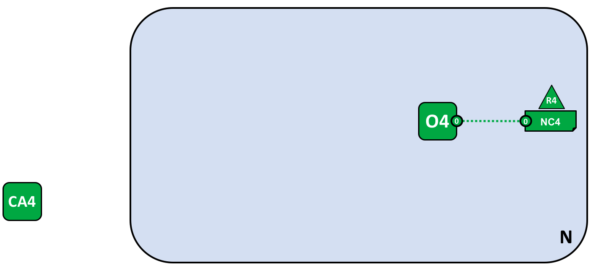
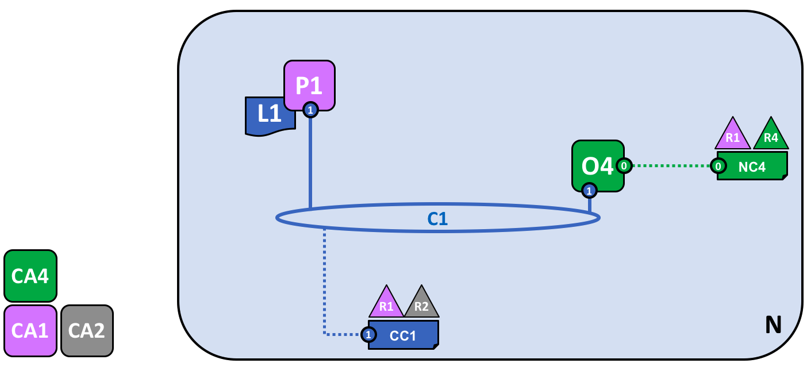
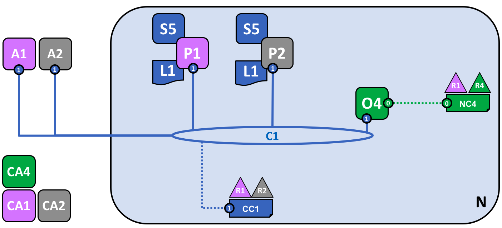
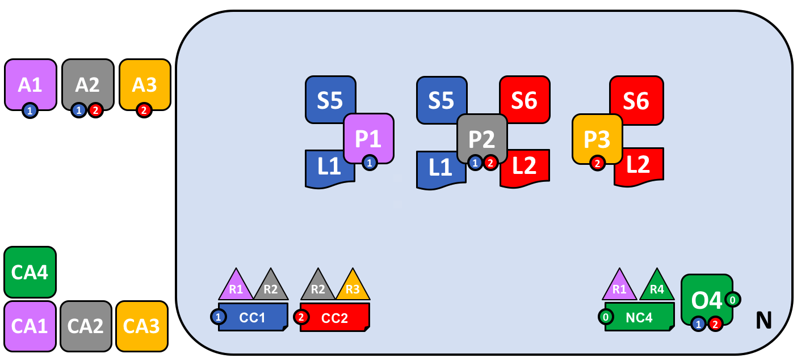

# Hyperledger Fabric Network - Hyperledger Fabric网络

## What is a Fabric Network? - 什么是Fabric网络？
A Fabric permissioned blockchain network is a technical infrastructure that provides ledger services to application consumers and administrators. In most
cases, multiple [organizations](../glossary.html#organization) come together as a [consortium](../glossary.html#consortium) to form the network and their permissions are determined by a set of [policies](../glossary.html#policy) that are agreed to by the
the consortium when the network is originally configured. Moreover, network policies
can change over time subject to the agreement of the organizations in the consortium.

Fabric许可的区块链网络是一种技术基础架构，可为应用程序使用者和管理员提供账本服务。在大多数情况下，多个 [组织](../glossary.html#organization) 作为一个 [联盟](../glossary.html#consortium) 组成网络，其权限由最初配置网络时联盟同意的一组 [策略](../glossary.html#policy) 确定。而且，网络政策经联盟中组织的同意，可以随时间变化。

This document will take you through the decisions that organizations will need to make to configure and deploy a Hyperledger Fabric network, form channels to transact within the network, and how to update those decisions within the life of the network. You will also learn how those decisions are embedded in the architecture and components of Hyperledger Fabric.

本文档将指导你完成组织配置和部署Hyperledger Fabric网络所需的决策，形成在网络内进行交易的通道，以及如何在网络生命周期内更新这些决策。你还将了解这些决策如何嵌入Hyperledger Fabric的体系结构和组件中。

## Who should read this? - 谁应该读这个？

In this topic, we'll focus on the major components of the network, why they exist, and when to use them.  This topic is intended for Blockchain Architects and Blockchain Network Administrators.  Blockchain application developers may also have an interest.  As this is intended to be a conceptual document, if you would like to dig deeper into the technical details we encourage you to review the available technical documents on this site.

在本主题中，我们将重点关注网络的主要组件，它们存在的原因，以及何时使用它们。本主题适用于区块链架构师和区块链网络管理员。区块链应用程序开发人员也可能有兴趣。由于这是一份概念性文件，如果你想深入了解技术细节，我们建议你查看本网站上可用的技术文档。

## The business requirements for the blockchain network -- Example - 区块链网络的业务要求——示例

The organizations RA, RB, RC and RD have decided to jointly invest in a Fabric blockchain network. Organization RA will contribute 3 peers, and 2 client applications of RA will consume the services of the blockchain network. Organization RB will contribute 4 peers and has 1 client application. Organization RC contributes 3 peers and has 2 client applications. Organization RD contributes 4 orderers.
Organization RA and RB have decided to form a consortium and exploit a separate application channel between the two of them. Organization RB and RC have decided to form another consortium and also exploit a separate application channel between the two of them. Each application channel has its own policy.

RA，RB，RC和RD组织已决定共同投资Fabric区块链网络。组织RA将贡献3个节点，并且RA的2个客户端应用将消耗区块链网络的服务。组织RB将贡献4个节点并拥有1个客户端应用程序。组织RC贡献了3个节点，并有2个客户端应用程序。组织RD贡献4个排序者。组织RA和RB决定组建一个联盟，并在两者之间利用单独的应用程序通道。组织RB和RC决定组建另一个联盟，并在两者之间利用单独的应用程序通道。每个应用程序通道都有自己的策略。

## Components of a Network - 网络的组成部分

A network consists of:

* [Ledgers](../glossary.html#ledger) (one per channel -- comprised of the [blockchain](../glossary.html#block) and the [state database](../glossary.html#state-database))
* [Smart contract(s)](../glossary.html#smart-contract) (aka chaincode)
* [Peer](../glossary.html#peer) nodes
* [Ordering service(s)](../glossary.html#ordering-service)
* [Channel(s)](../glossary.html#channel)
* [Fabric Certificate Authorities](../glossary.html#hyperledger-fabric-ca)

网络包括：
* [账本](../glossary.html#ledger) （一个账本的每个通道由 [区块链](../glossary.html#block) 和 [状态数据库](../glossary.html#state-database)）
* [智能合约](../glossary.html#smart-contract) （又名链码）
* [节点](../glossary.html#peer) 
* [排序服务](../glossary.html#ordering-service) 
* [通道](../glossary.html#channel) 
* [Fabric CA](../glossary.html#hyperledger-fabric-ca) 

### Consumers of Network Services - 网络服务的消费者

* Client applications owned by organizations
* Clients of Blockchain network administrators

* 组织拥有的客户端应用程序
* 区块链网络管理员的客户端

### Network Policies and Identities - 网络政策和身份

The Fabric Certificate Authority (CA) issues the certificates for organizations to authenticate to the network.  There can be one or more CAs on the network and organizations can choose to use their own CA.  Additionally, client applications owned by organizations in the consortium use certificates to authenticate [transaction](../glossary.html#transaction) [proposals](../glossary.html#proposal), and peers use them to endorse proposals and commit transactions to the ledger if they are valid.

Fabric证书授权中心（CA）颁发证书，供组织对网络进行身份验证。网络上可以有一个或多个CA，组织可以选择使用自己的CA。此外，联盟中的组织拥有的客户端应用程序使用证书来验证 [交易](../glossary.html#transaction) [提案](../glossary.html#proposal) ，并且如果它们有效，则节点使用它们来背书提案并将交易提交到账本。

*The explanation of the diagram is as follows:
There is a Fabric network N with network policy NP1 and ordering service O. Channel C1 is governed by channel policy CP1.  Channel C1 has been established by consortium RARB. Channel C1 is managed by ordering service O and peers P1 and P2 and client applications A1 and A2 have been granted permission to transact on C1. Client application A1 is owned by organization RA. Certificate authority CA1 serves organization RA. Peer P2 maintains ledger L1 associated with channel C1 and L2 associated with C2. Peer P2 makes use of chain code S4 and S5. The orderer nodes of ordering service O are owned by organization RD.*

*该图的说明如下：存在Fabric网络N，网络策略NP1和排序服务O.通道C1由通道策略CP1管理。通道C1由联盟RARB建立。通道C1通过排序服务O和节点P1和P2来管理，并且客户端应用程序A1和A2已被授予许可在C1上进行交易。客户端应用程序A1由组织RA拥有。证书授权中心CA1为组织RA服务。节点P2维持与通道C1相关联的账本L1和与C2相关联的L2。节点P2使用链码S4和S5。排序服务O的排序节点由组织RD拥有。*

## Creating the Network - 创建网络

The network is created from the definition of the consortium including its clients, peers, channels, and ordering service(s).  The ordering service is the administration point for the network because it contains the configuration for the channel(s) within the network.  The configurations for each channel includes the policies for the channel and the [membership](../glossary.html#membership-services) information (in this example X509 root certificates) for each member of the channel.

网络是根据联盟的定义创建的，包括其客户，节点，通道和排序服务。排序服务是网络的管理点，因为它包含网络中通道的配置。每个通道的配置包括通道的策略和通道的每个[成员](../glossary.html#membership-services)的成员信息（在此示例中为X509根证书）。

## Defining a Consortium - 定义一个联盟

A consortium is comprised of two or more organizations on the network.  Consortiums are defined by organizations that have a need for transacting business with one another and they must agree to the policies that govern the network.

联盟由网络上的两个或更多组织构成。联盟由需要彼此进行业务交易的组织定义，并且它们必须同意管理网络的策略。

## Creating a channel for a consortium - 为联盟创建一个通道

A channel is a communication means used to connect the components of the network and/or the member client applications.  Channels are created by generating the configuration block on the ordering service, which evaluates the validity of the channel configuration. Channels are useful because they allow for data isolation and confidentiality.  Transacting organizations must be authenticated to a channel in order to interact with it.  Channels are governed by the policies they are configured with.

通道是用于连接网络组件和/或成员客户端应用程序的通信装置。通过在排序服务上生成配置区块来创建通道，该排序服务评估通道配置的有效性。通道很有用，因为它们允许数据隔离和机密性。必须对交易组织进行身份验证才能与其进行交互。通道由其配置的策略控制。

## Peers and Channels - 节点与通道

Peers are joined to channels by the organizations that own them, and there can be multiple peer nodes on channels within the network.  Peers can take on multiple roles:

* [*Endorsing peer*](../glossary.html#endorsement) -- defined by policy as specific nodes that execute smart contract transactions in simulation and return a proposal response (endorsement) to the client application.
* [*Committing peer*](../glossary.html#commitment) -- validates blocks of ordered transactions and commits (writes/appends) the blocks to a copy of the ledger it maintains.

节点由拥有它们的组织加入通道，并且网络中的通道上可以有多个节点。节点可以承担多种角色：

* [*背书节点*](../glossary.html#endorsement) ——由策略定义为在模拟中执行智能合约交易的特定节点，并响应提案（背书）返回给客户端应用程序。
* [*提交节点*](../glossary.html#commitment) ——验证有序交易区块并将区块提交（写入/附加）到它维护的账本的副本。

Because all peers maintain a copy of the ledger for every channel to which they are joined, all peers are committing peers.  However, only peers specified by the endorsement policy of the smart contract can be endorsing peers.  A peer may be further defined by the roles below:

* [*Anchor peer*](../glossary.html#anchor-peer) -- defined in the channel configuration and is the first peer that will be discovered on the network by other organizations within a channel they are joined to.
* [*Leading peer*](../glossary.html#leading-peer) -- exists on the network to communicate with the ordering service on behalf of an organization that has multiple peers.

因为所有节点都为它们所加入的每个通道维护账本的副本，所以所有节点都为提交节点。但是，只有智能合约的背书策略所指定的节点才是背书节点。可以通过以下角色进一步定义节点：

* [*锚节点*](../glossary.html#anchor-peer) ——在通道配置中定义，是第一个将由其加入的通道中的其他组织在网络上发现的节点。
* [*主导节点*](../glossary.html#leading-peer) ——存在于网络上，代表具有多个节点的组织与排序服务进行通信。

## Applications and Smart Contracts - 应用程序与智能合约

Smart contract chaincode must be [installed](../glossary.html#install) and [instantiated](../glossary.html#instantiate) on a peer in order for a client application to be able to [invoke](../glossary.html#invoke) the smart contract.  Client applications are the only place outside the network where transaction proposals are generated.  When a transaction is proposed by a client application, the smart contract is invoked on the endorsing peers who simulate the execution of the smart contract against their copy of the ledger and send the proposal response (endorsement) back to the client application.  The client application assembles these responses into a transaction and broadcasts it to the ordering service.

必须在节点上 [安装](../glossary.html#install) 并 [实例化](../glossary.html#instantiate) 智能合约链码，以便客户端应用程序能够 [调用](../glossary.html#invoke) 智能合约。客户端应用程序是网络外唯一生成交提案的位置。当客户端应用程序提出交易时，智能合约将在模拟智能合约执行的背书节点上针对其账本副本调用，并将提案回应（背书）发送回客户端应用程序。客户端应用程序将这些回应组合到一个交易中并将其广播到排序服务。

## Growing the network - 发展网络

While there no theoretical limit to how big a network can get, as the network grows it is important to consider design choices that will help optimize network throughput, stability, and resilience.  Evaluations of network policies and implementation of [gossip protocol](../gossip.html#gossip-protocol) to accommodate a large number of peer nodes are potential considerations.

虽然对网络的大小没有理论上的限制，但随着网络的发展，考虑有助于优化网络吞吐量，稳定性和弹性的设计选择非常重要。评估网络策略和实现 [gossip协议](../gossip.html#gossip-protocol) 以容纳大量节点是潜在的考虑因素。 

## Simplifying the visual vocabulary - 简化视觉词汇

*In the diagram below we see that there are two client applications connected to two peer nodes and an ordering service on one channel.  Since there is only one channel, there is only one logical ledger in this example.  As in the case of this single channel, P1 and P2 will have identical copies of the ledger (L1) and smart contract -- aka chaincode (S4).*

*在下图中，我们看到有两个客户端应用程序连接到两个节点，一个通道上有一个排序服务。由于只有一个通道，因此本例中只有一个逻辑账本。与此单一渠道的情况一样，P1和P2将具有相同的账本（L1）和智能合约副本 ——即链码（S4）。*

## Adding another consortium definition - 添加另一个联盟定义

As consortia are defined and added to the existing channel, we must update the channel configuration by sending a channel configuration update transaction to the ordering service. If the transaction is valid, the ordering service will generate a new configuration block.  Peers on the network will then have to validate the new channel configuration block generated by the ordering service and update their channel configurations if they validate the new block.  It is important to note that the channel configuration update transaction is handled by [*system chaincode*](../glossary.html#system-chain) as invoked by the Blockchain network Administrator, and is not invoked by client application transaction proposals.

由于联盟被定义并添加到现有通道，我们必须通过向排序服务发送通道配置更新交易来更新通道配置。如果交易有效，则排序服务将生成新的配置块。然后，网络上的节点必须验证排序服务生成的新通道配置块，并在验证新块时更新其通道配置。重要的是，要注意，通道配置更新交易由区块链网络管理员调用的 [*系统链码*](../glossary.html#system-chain) 处理，并且不由客户端应用程序交易提案调用。

## Adding a new channel - 添加新通道

Organizations are what form and join channels, and channel configurations can be amended to add organizations as the network grows. When adding a new channel to the network, channel policies remain separate from other channels configured on the same network.

组织形成并加入到通道，并且可以修改通道配置以随着网络的发展增加组织。向网络添加新通道时，通道策略与在同一网络上配置的其他通道保持独立。

*In this example, the configurations for channel 1 and channel 2 on the ordering service will remain separate from one another.*

*在此示例中，排序服务上的通道1和通道2的配置将保持彼此分离。*

## Adding another peer - 添加另一个节点

*In this example, peer 3 (P3) owned by organization 3 has been added to channel 2 (C2).  Note that although there can be multiple ordering services on the network, there can also be a single ordering service that governs multiple channels.  In this example, the channel policies of C2 are isolated from those of C1.  Peer 3 (P3) is also isolated from C1 as it is authenticated only to C2.*

*在该示例中，组织3拥有的节点3（P3）已被添加到通道2（C2）。请注意，虽然网络上可以有多个排序服务，但也可以有一个管理多个通道的排序服务。在此示例中，C2的通道策略与C1的通道策略隔离。节点3（P3）也与C1隔离，因为它仅对C2进行了认证。*

## Joining a peer to multiple channels - 将一个节点加入多个通道

*In this example, peer 2 (P2) has been joined to channel 2 (C2).  P2 will keep channels C1 and C2 and their associated transactions private and isolated.  Additionally, client application A3 will also be isolated from C1.  The ordering service maintains network governance and channel isolation by evaluating policies and digital signatures of all nodes configured on all channels.*

*在此示例中，节点2（P2）已加入到通道2（C2）。P2将保持通道C1和C2及其相关交易的私密性和隔离性。此外，客户端应用程序A3也将与C1隔离。排序服务通过评估在所有通道上配置的所有节点的策略和数字签名来维护网络治理和通道隔离。*

## Network fully formed - 网络完全形成

*In this example, the network has been developed to include multiple client applications, peers, and channels connected to a single ordering service. Peer 2 (P2) is the only peer node connected to channels C1 and C2, which will be kept isolated from each other and their data will remain private.  There are now two logical ledgers in this example, one for C1, and one for C2.*

*在该示例中，网络已经被开发为包括连接到单个排序服务的多个客户端应用，节点和通道。节点2（P2）是连接到通道C1和C2的唯一节点，它们将彼此隔离，并且它们的数据将保持私密性。此示例中现在有两个逻辑账本，一个用于C1，另一个用于C2。*

Simple vocabulary - 简单的词汇

Better arrangement - 更好的安排

