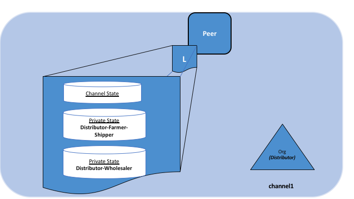

# 私有数据

## 什么是私有数据？

当某个通道上的一群组织需要对数据进行保密，以使得同通道上的其他组织无法访问这些数据时，它们可以创建一个新通道，其中只包含需要访问这些数据的组织。但是，在以上情况下创建单独的通道肯定会产生额外的管理开销（如维护链码版本、策略、MSP 等），而且无法实现让通道上所有成员都能看到一项交易的同时还保证部分数据私有。

这就是为什么 Fabric 从 v1.2 开始支持**创建私有数据集合**，它使得通道上被定义的组织子集无需创建单独通道就能够对私有数据进行背书、提交或查询。

## 什么是私有数据集？

私有数据集是以下两种成分的组合：

1. **实际的私有数据**，该数据的传送是通过 [Gossip 协议](../gossip.html)点对点进行的，并且只发送给已授权组织。实际私有数据被储存在已授权组织的节点上的私有数据库中，可通过调用这些授权节点上的链码来访问这些数据。排序服务未参加此环节也无法看到以上数据。注意，由于 gossip 以点对点的方式向已授权组织分发私有数据，因此必须在通道上创建锚节点，同时还要在每个 peer 上配置CORE_PEER_GOSSIP_EXTERNALENDPOINT ，从而引导跨组织的通信。

2. **该数据的哈希值**，该数据获得背书、排序之后被写入通道上每个节点的账本中。哈希值作为交易的证明，可用于状态验证和审计。

下图展示了两个节点的账本内容，其中一个被授权拥有私有数据，另一个未获授权。

如果集合成员陷入争议，或者想把资产转让给第三方，它们可能会选择与其他方共享私有数据。参与资产转让的第三方将计算私有数据的哈希，看其是否与通道账本上的状态相匹配，从而证明在某个时间点上，集合成员之间的确存在该状态。

在某些情况中，你可能会选择让一组私有数据集中的每项都只包含一个组织。例如，组织可以将私有数据记录在各自的集合中，后期这些数据可能会被拿来与其他通道成员共享并在链码交易中引用。下文中私有数据共享部分的内容会谈到相关示例。

### 在通道内什么时候使用私有数据集，什么时候使用单独通道

* 当通道成员的一群组织必须对所有交易（和账本）保密时，使用**通道**。

* 当交易（和账本）必须在一群组织间共享，并且这些组织中只有一部分组织可以访问交易中一些（或全部）私有数据时，使用**集合**。此外，由于私有数据是点对点传播的，而不是通过区块传播，所以当交易数据必须对排序服务节点保密时，应该使用私有数据集合。

## 解释集合的一个案例

设想一个通道上有五个交易农产品的组织：

* **农民**把产品销往国外
* **分销商**将货物运往国外
* **托运商**负责参与方之间的货物运输
* **批发商**从分销商那里采购商品
* **零售商**从托运人和批发商那里采购商品

**分销商**可能希望与**农民**和**托运商**之间保持私密交易，从而使得**批发商**和**零售商**无从得知这些交易条款（以免暴露他们加价的事实）。

**分销商**还可能希望与**批发商**建立单独的私有数据关系，因为它向批发商收取的价格比向**零售商**收取的价格低。

**批发商**还可能希望与**零售商**和**托运商**建立私有数据关系。

与其为这些私有数据关系定义许多小通道，不如定义多个私有数据集合（**PDC**）在以下各方之间共享私有数据：

1. PDC1：**分销商**，**农民**和**托运商**
2. PDC2：**分销商**和**批发商**
3. PDC3：**批发商**、**零售商**和**托运商**

拿上述例子来说，**分销商**拥有的节点在其账本储存了多个私有数据库，这些数据库中包含了来自**分销商**、**农民**和**托运商**关系以及**分销商**和**批发商**关系的私有数据。

## 私有数据的交易流程

当在链码中引用私有数据集合时，为了保护私有数据在提案、背书和提交交易过程中的机密性，私有数据的交易流程略有不同。

关于不使用私有数据的交易流程的详细信息，请参阅我们关于[交易流程](../txflow.html)的文档。

1. 客户端应用程序向背书节点提交一项提案，请求调用一个链码函数（读取或写入私有数据），这些背书节点属于私有数据集合中已授权组织的一部分。私有数据，或用于在链码中生成私有数据的数据，被发送到提案的 `transient` 字段中。
2. 背书节点模拟交易，并将私有数据存储在 `transient data store`  （节点的本地临时存储库）中。这些背书节点根据组织集合的策略将私有数据通过 [gossip](../gossip.html) 分发给授权的节点。
3. 背书节点将提案响应发送回客户端。提案响应中包含经过背书的读写集，这其中包含了公共数据，还包含任何私有数据键和值的哈希。*私有数据不会被发送回客户端*。更多关于带有私有数据的背书的信息，请查看[这里](../private-data-arch.html#endorsement)。
4. 客户端应用程序将交易（包含带有私有数据哈希值的提案响应）提交给排序服务。带有私有数据哈希的交易同样被包含在区块中。带有私有数据哈希的区块被分发给所有节点。这样，通道中的所有节点就可以在不知道真实私有数据的情况下，用同样的方式来验证带有私有数据哈希值的交易。
5. 在区块提交的时候，授权的节点会根据集合策略来决定它们是否有权访问私有数据。如果节点有访问权，它们会先检查自己的本地 ` transient data store ` ，以确定它们是否在链码背书的时候已经接收到了私有数据。如果没有的话，它们会尝试从其他已授权节点那里拉取私有数据，然后对照公共区块上的哈希值来验证私有数据并提交交易和区块。当验证或提交结束后，私有数据会被移动到这些节点私有数据库和私有读写存储的副本中。随后 ` transient data store  ` 中存储的这些私有数据会被删除。

## 共享私有数据

在多数情况下，一个私有数据集合中的私有数据键或值可能需要与其他通道成员或者私有数据集合共享，例如，当你需要和一个通道成员或者一组通道成员交易私有数据，而初始私有数据集合中并没有这些成员时。私有数据的接收方一般都会在交易过程中对照链上的哈希值来验证私有数据。

私有数据集合的以下几个方面促成了私有数据的共享和验证：

* 首先，只要符合背书策略，尽管你不是私有数据集的成员也可以为集合写入键。可以在链码层面，键层面（用基于状态的背书）或者集合层面（始于 Fabric v2.0）上定义背书策略。
* 其次，从 v1.4.2 开始出现了链码 API（应用程序编程接口） GetPrivateDataHash() ，它支持非集合成员节点上的链码读取一个私有键的哈希值。下文中你将发现这是一个十分重要的功能，因为它允许链码对照之前交易中私有数据生成的链上哈希来验证私有数据。

当设计应用程序和相关私有数据集合时需要考虑这种共享和验证私有数据的能力。您当然可以创建出几组多边私有数据集合以供多个通道成员组合之间共享数据，但是这样做的话你就需要定义大量私有数据集合。或者你也可以考虑使用少量私有数据集合（例如，每个组织用一个集合，或者每对组织用一个集合），然后和其他通道成员共享私有数据，有需要时还可以和其他集合共享私有数据。从 Fabric v2.0 开始，隐含的组织特定集合可供所有链码使用，这样一来部署链码的时候你就不用定义每个组织中的私有数据集合。

### 私有数据共享模式

为各组织的私有数据集合构建模型时，有多种模式可被用来共享或传输私有数据，且无需费力定义多个多边集合。以下是链码应用程序中可以使用的一些共享模式：

* **使用相应的公钥来追踪公共状态**：您可以选择使用一个相应的公钥来追踪特定的公共状态（例如：资产性质，当前所有权等公共状态），对于每个需要拥有资产相应私有数据访问权的组织，您可以在它们的私有数据集合中创建一个私有秘钥或值。
* **链码访问控制**：您可以在您的链码中执行访问控制，指明什么客户端应用程序能够查询私有数据集合中的私有数据。例如，为一个或多个私有数据集合键存储一个访问控制列表，然后在链码中获取客户端应用程序提交者的证书（使用 GetCreator() chaincode API or CID library API GetID() or GetMSPID()来获取），并在返回私有数据之前验证这些证书。同样，为了访问私有数据，您可以要求客户端将密码短语传送到链码中，且该短语必须与存储在秘钥级别的密码短语相匹配。注意，这种模式也可用于限制客户端对公共状态数据的访问权。
* **使用带外数据来共享私有数据**：这是一种链下选项，您可以同其他组织以带外数据的形式共享私有数据，这些组织可使用 GetPrivateDataHash() 链码 API 将键或值转换成哈希以验证其是否与链上哈希匹配。例如，如果一个组织想要购买一份你的资产，那么在同意购买之前它会检查链上哈希，以验证如下事项：该资产的属性；你是否为该资产的合法所有人。
* **与其他集合共享私有数据**：您可以同链码在链上共享私有数据，该链码在其他组织的私有数据集合中生成一个相应的键或值。你将通过临时字段把私有数据键或值传送给链码，收到私有数据后该链码使用 GetPrivateDataHash() 验证此私有数据的一个哈希是否与您集合中的链上哈希一致，随后将该私有数据写入其他组织的私有数据集合中。
* **将私有数据传送给其他集合**：您可以使用链码来”传送“私有数据，该链码把您集合中的私有数据键删除，然后在其他组织的集合中生成。与上述方法相同，这里在调用链码时使用临时字段传输私有数据，并且在链码中用 GetPrivateDataHash() 来验证你的私有数据集合中是否存在该数据，验证成功之后再把你的集合中该数据删除，并在其他组织的集合中生成该键。为确保每次操作都会从一个集合中删除一项交易并在另一个集合中添加该交易，你可能需要获得一些额外组织的背书，如监管者或审计者。
* **使用私有数据进行交易确认**：如果您想在交易完成之前获得竞争对手的批准（即竞争对手同意以某价钱购买一项资产这一链上记录），链码会在竞争对手或您自己的私有数据集合中写入一个私有数据（链码随后将使用 GetPrivateDataHash() 来验证该数据），从而要求竞争对手”率先批准“这项交易。事实上，嵌入式生命周期系统链码就是使用这种机制来确保链码定义在被提交到通道之前已经获得通道上各组织的同意。这种私有数据共享模式从从 Fabric v2.0 开始凭借集合层面的背书策略变得越来越强大，确保在集合拥有者自己的信任节点上执行、背书链码。或者，您也可以使用具有秘钥层面背书策略、共同商定的秘钥，随后该秘钥被预先批准的条款更新，并且在指定组织的节点上获得背书。
* **使交易者保密**：对上一种共享模式进行些许变化还可以实现指定交易的交易者不被暴露。例如，买方表示同意在自己的私有数据集合上进行购买，随后在接下来的交易中卖方会在自己的私有数据集合中引用该买方的私有数据。

结合以上几种模式，我们可以发现，私有数据的交易和普通的通道状态数据交易情况类似，特别是以下几点：

* **重要级别交易访问控制**：您可以在私有数据值中加入 所有权证书，这样一来，后续发生的交易就能够验证数据提交者是否具有共享和传输数据的所有权。在这种情况下，链码会获取数据提交者的证书（例如：使用 GetCreator() chaincode API or CID library API GetID() or GetMSPID() ），将此证书与链码收到的其他私有数据合并，
* **重要级别背书策略**：和正常的通道状态数据一样，您可以使用基于状态的背书策略来指明哪些组织必须对共享或转移私有数据的交易做出背书，使用 SetPrivateDataValidationParameter() chaincode API  来进行一些操作，例如，指明必须对上述交易作出背书的仅包括一个拥有者的组织节点，托管组织的节点或者第三方组织。

### 私有数据共享案例

将上述私有数据共享模式结合起来能够赋能基于链码的应用程序。例如，思考一下如何使用各组织私有数据集合来实现资产转移场景：

* 在公共链码状态使用UUID键可以追踪一项资产。所记录信息只包括资产的所属权，没有其他信息。
* 链码要求：所有资产转移请求必须源自拥有者客户端，并且该键是基于
* 资产拥有者的私有数据集合包含了有关该资产的私有信息，
* 假定管理员是各私有数据集合的一员，因此它一直维护着私有数据，即使他并没必要这么做。

一项资产交易的进行情况如下：

1. 链下，资产所有者和意向买家同意以某一特定价格交易该资产。
2. 卖家通过以下方式提供资产所有权证明：利用带外数据传输私有信息；或者出示证书以供买家在其自身节点或管理员节点上查询私有数据。
3. 买家验证私有信息的哈希是否匹配链上公共哈希。
4. 买家通过调取链码来在其自身私有数据集合中记录投标细节信息。一般在买家自己的节点上调取链码，但如果集合背书策略有相关规定，则也可能会在管理员节点上调取链码。
5. 当前的资产所有者（卖家）调取链码来卖出、转移资产，传递私有信息和投标信息。在卖家、买家和管理员的节点上调用链码，以满足公钥的背书策略以及买家和买家私有数据集合的背书策略。
6. 链码验证交易发送方是否为资产拥有者，根据卖家私有数据集合中的哈希来验证私有细节信息，同时还会根据买家私有数据集合中的哈希来验证投标细节信息。随后链码为公钥书写提案更新（将资产拥有者设定为买家，将背书策略设定为买家和管理员），把私有细节信息写入买家的私有数据集合中，以上步骤成功完成后链码会把卖家私有数据集合中的相关私有细节信息删除。在最终背书之前，背书节点会确保已将私有数据分布给卖家和管理员的所有授权节点。
7. 卖家提交交易等待排序，其中包括了公钥和私钥哈希，随后该交易被分布到区块中的所有通道节点上。
8. 每个节点的区块验证逻辑都将一致性地验证背书策略是否得到满足（买家、卖家和管理员都作出背书），同时还验证链码中已读取的公钥和私钥自链码执行以来未被任何其他交易更改。
9. 所有节点提交的交易都是有效的，因为交易已经通过验证。如果买家和管理员节点在背书时未收到私有数据的话，它们将会从其他授权节点那里获取这些私有数据，并将这些数据保存在自己的私有数据状态数据库中（假定私有数据与交易的哈希匹配）。
10. 交易完成后，资产被成功转移，其他对该资产感兴趣的通道成员可能会查询公钥的历史以了解该资产的来历，但是它们无法访问任何私有细节信息，除非资产拥有者在须知的基础上共享这些信息。

以上是最基本的资产转移场景，我么可以对其进行扩展，例如，资产转移链码可能会验证一项付款记录是否可用于满足付款和交付要求，或者可能会验证一个银行是否在执行资产转移链码之前已经提交了信用证。交易各方并不直接维护节点，而是通过那些运行节点的托管组织来进行交易。

## 清除私有数据

对于非常敏感的数据，即使是共享私有数据的各方可能也希望（或者应政府相关法规要求必须）定期“清除”节点上的数据，仅把这些敏感数据的哈希留在区块链上，作为私有数据不可篡改的证据。

在某些情况下，私有数据只需要在其被复制到节点区块链外部的数据库之前存在于该节点的私有数据库中。而数据或许也只需要在链码业务流程结束之前存在于节点上（交易结算、合约履行等）。

为了支持这些用户案例，如果私有数据已经持续 N 个块都没有被修改，则可以清除该私有数据，N 是可配置的。链码中无法查询已被清除的私有数据，并且其他节点也请求不到。

## 私有数据集合怎么定义

有关集合定义的更多详细信息，以及关于私有数据和集合的其他更底层的信息，请参阅[私有数据主题](../private-data-arch.html)。

<!--- Licensed under Creative Commons Attribution 4.0 International License
https://creativecommons.org/licenses/by/4.0/ -->
